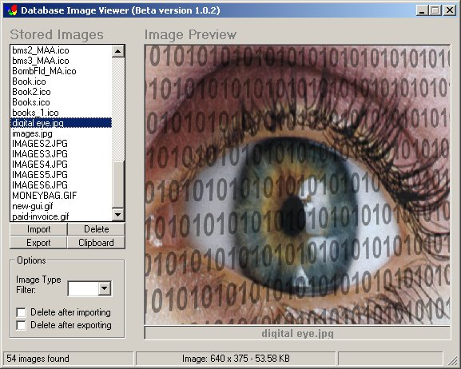



## Image Database 1\.0

### Description

Organizes and saves images into a single access database. You can import/export single or multiple images at a time. Handles *.bmp, *.jpeg, *.jpg, *.wmf, *.ico, and *.gif image files. Great tool to keep and organize your image collections into one single access database. This is only a start. I do realize that more polishing and debugging need to be done. I hope someone just learn something from it.
 
### More Info
 
I wrote this in 1 day and still need to put in some database utilities to handle the upkeep of the database. ie - repair and compact database.

             |
---                |---
**Submitted On**   |2005-01-02 21:01:44
**By**             |[L\. M\. Trivette ](https://github.com/Planet-Source-Code/PSCIndex/blob/master/ByAuthor/l-m-trivette.md)
**Level**          |Advanced
**User Rating**    |4.8 (43 globes from 9 users)
**Compatibility**  |VB 6\.0
**Category**       |[Complete Applications](https://github.com/Planet-Source-Code/PSCIndex/blob/master/ByCategory/complete-applications__1-27.md)
**World**          |[Visual Basic](https://github.com/Planet-Source-Code/PSCIndex/blob/master/ByWorld/visual-basic.md)
**Archive File**   |[Image\_Data183634132005\.zip](https://github.com/Planet-Source-Code/l-m-trivette-image-database-1-0__1-58070/archive/master.zip)

